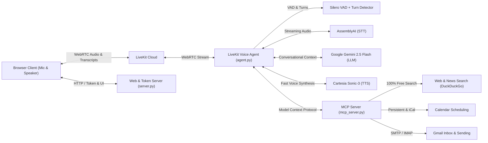

# LiveKit Voice AI Assistant — Production & Deployment Guide

A fully functional, ultra-low-latency real-time voice AI assistant built on [LiveKit Agents](https://docs.livekit.io/agents/), featuring:
- **Speech-to-Text (STT)**: AssemblyAI Universal Streaming
- **Language Model (LLM)**: Google Gemini 2.5 Flash (`gemini-2.5-flash`)
- **Text-to-Speech (TTS)**: Cartesia Sonic-3
- **Voice Activity Detection (VAD)**: Silero VAD
- **Turn Detection & Interruption**: LiveKit ML TurnDetector
- **Noise Cancellation**: LiveKit BVC
- **WebRTC Transport**: LiveKit Cloud
- **Model Context Protocol (MCP)**: Native integration for free Web Search, Calendar scheduling, and Gmail
- **Web Interface & Token Server**: Embedded Python HTTP server with CORS, health checks, and responsive UI

---

## Architecture



---

## Key Bugs Identified & Resolved

1. **VAD Argument Crash**: `silero.VAD.load(execution_providers=["CPUExecutionProvider"])` threw `TypeError: VAD.load() got an unexpected keyword argument 'execution_providers'` on any incoming call. Fixed by calling `silero.VAD.load()`.
2. **Silent Agent Non-Dispatch**: Specifying `agent_name="my-voice-agent"` in `WorkerOptions` activates explicit dispatch in LiveKit Cloud. However, `server.py` was minting standard tokens without room agent dispatches, causing LiveKit Cloud to never dispatch rooms to the agent. Fixed in both `server.py` (token now includes `RoomConfiguration(agents=[RoomAgentDispatch(agent_name=...)])`) and `agent.py`.
3. **Python Version Incompatibility**: `pyproject.toml` had `requires-python = ">=3.14"`, making installation fail on virtually all standard Linux production environments, Docker base images, and cloud PaaS hosts running Python 3.10–3.13. Relaxed to `requires-python = ">=3.10,<3.15"`.
4. **Turn Detector Deprecation & Missing Weights**: Replaced deprecated `turn_detection=TurnDetector()` parameter with `turn_handling={"turn_detection": TurnDetector()}`. Updated model downloader to `python -m livekit.agents download-files` to pull all ONNX weights from Hugging Face.
5. **No Greeting & Empty Room Audio**: Added participant detection and an initial proactive greeting (`await session.say(...)`) so the assistant warmly greets the user upon connecting.
6. **Frontend Enhancements**:
   - Modern glassmorphic interface with animated reactive Voice Orb (pulses violet when AI speaks, emerald when user speaks).
   - Real-time streaming transcription with interim segment updates and timestamping.
   - Proper audio element cleanup on track unsubscription to prevent audio element leaks.
   - Fallback text input so users can type questions if microphone input is unavailable.
   - Clear diagnostic error messages for microphone permission rejection or connection drops.
7. **End-to-End Deployment Readiness**:
   - Added `run_all.py` to start both the agent worker and web server together with a single command.
   - Added production `Dockerfile` with multi-stage build and pre-downloaded ONNX models.
   - Added `docker-compose.yml` for unified or microservice deployments.
   - Added `/health` and `/api/health` endpoints for container orchestration health checks.
   - Added `requirements.txt` for environments without `uv`.
   - Added `.dockerignore` and `.env.example`.

---

## Quickstart (Local Development)

### 1. Prerequisites
- Python 3.10+ (or [uv](https://docs.astral.sh/uv/))
- Valid API keys in `.env` for:
  - LiveKit (`LIVEKIT_URL`, `LIVEKIT_API_KEY`, `LIVEKIT_API_SECRET`)
  - AssemblyAI (`ASSEMBLYAI_API_KEY`)
  - Cartesia (`CARTESIA_API_KEY`)
  - Google Gemini (`GOOGLE_API_KEY`)

### 2. Install & Download Models
```bash
# Sync dependencies
uv sync

# Download VAD and Turn-Detector model weights (one-time setup)
uv run python -m livekit.agents download-files
```

*(If using standard pip: `pip install -r requirements.txt && python -m livekit.agents download-files`)*

### 3. Run Everything (One Command)
```bash
uv run run_all.py
```
Open your browser at **[http://localhost:8000](http://localhost:8000)**, allow microphone access, and click **Connect & Start Talking**.

---

### Alternative: Running in Separate Terminals

**Terminal 1 — Token & Web Server:**
```bash
uv run server.py
```

**Terminal 2 — LiveKit Agent Worker:**
```bash
uv run agent.py dev
```

---

---

## Model Context Protocol (MCP) Tools (100% Free)

The agent connects via standard `MCPServerStdio` to `mcp_server.py`, equipping the voice model with 8 real-time tools:

### 1. Web & News Search (DuckDuckGo)
- **`search_web(query, max_results=4)`**: Real-time web search for current events, facts, weather, documentation, etc.
- **`search_news(query, max_results=4)`**: Fetches breaking news headlines and article excerpts.
- *Cost*: **100% FREE** with zero rate limits and no API key required.

### 2. Calendar Management
- **`calendar_list_events(timeframe='today')`**: List events for `today`, `tomorrow`, `this_week`, `all`, or a specific date.
- **`calendar_create_event(title, date, start_time, end_time, description, location)`**: Create and persist a new appointment.
- **`calendar_delete_event(event_id)`**: Cancel an event by ID.
- *Google Calendar Sync (Optional)*: Set `GOOGLE_CALENDAR_ICAL_URL` in `.env` to automatically merge events from your live Google Calendar.

### 3. Gmail Integration
- **`gmail_send_email(to_email, subject, body)`**: Composes and sends real emails via Gmail SMTP (`smtp.gmail.com:465` SSL).
- **`gmail_read_inbox(max_results=5, unread_only=True)`**: Reads and extracts sender, subject, and snippet from Gmail inbox via IMAP (`imap.gmail.com:993` SSL).
- **`gmail_search_emails(query, max_results=5)`**: Searches emails by keyword or sender.
- *Cost*: **100% FREE** using standard Google App Passwords:
  1. Visit [myaccount.google.com/apppasswords](https://myaccount.google.com/apppasswords).
  2. Generate a 16-letter App Password for "Mail".
  3. Add `GMAIL_ADDRESS` and `GMAIL_APP_PASSWORD` to your `.env` or Railway settings.
  *(If credentials are not yet configured, the agent gracefully records messages to a simulated outbox so workflows never fail!)*

---

## Cloud & Production Deployment

### Option 1: Docker (Single Container)
Build the production Docker image (model weights are pre-cached inside the image for fast sub-second startup):

```bash
# Build the Docker image
docker build -t livekit-voice-agent .

# Run the container
docker run -d \
  --name livekit-voice-agent \
  -p 8000:8000 \
  --env-file .env \
  livekit-voice-agent
```

### Option 2: Docker Compose
```bash
docker compose up -d
```
Inspect logs:
```bash
docker compose logs -f
```

### Option 3: Deploy to Cloud PaaS (Render / Railway / Fly.io)

1. **Render.com**:
   - Create a **Web Service** from your repository.
   - Select **Docker** runtime.
   - Add environment variables from `.env` in the Render dashboard.
   - Health check path: `/health`.

2. **Railway.app**:
   - Create a new project and connect this repo.
   - Railway automatically detects the `Dockerfile`.
   - Under Settings > Variables, add the keys from `.env`.
   - Port: `8000`.

3. **Fly.io**:
   ```bash
   fly launch
   fly secrets import < .env
   fly deploy
   ```

4. **AWS / GCP / DigitalOcean VPS**:
   - Provision a small Ubuntu 22.04 / 24.04 instance (1 vCPU, 2GB RAM is sufficient).
   - Clone repo, configure `.env`, run `docker compose up -d`.
   - Setup Nginx or Caddy with HTTPS (WebRTC requires HTTPS/WSS when accessed outside `localhost`).

---

## Health Check & API Endpoints

- `GET /` — Serves web voice client (`frontend/index.html`)
- `GET /health` — Returns JSON health status:
  ```json
  {
    "status": "healthy",
    "livekit_configured": true,
    "agent_name": "my-voice-agent"
  }
  ```
- `GET /api/token?identity=Name&room=room-id` — Issues LiveKit room join token with explicit agent dispatch claims.

---

## Environment Variables Reference

| Variable | Required | Description |
| :--- | :---: | :--- |
| `LIVEKIT_URL` | Yes | LiveKit Cloud WebSocket URL (`wss://...`) |
| `LIVEKIT_API_KEY` | Yes | LiveKit project API key |
| `LIVEKIT_API_SECRET` | Yes | LiveKit project API secret |
| `GOOGLE_API_KEY` | Yes | Google Gemini API key for `gemini-2.5-flash` |
| `CARTESIA_API_KEY` | Yes | Cartesia API key for `sonic-3` TTS |
| `ASSEMBLYAI_API_KEY` | Yes | AssemblyAI API key for streaming STT |
| `LIVEKIT_AGENT_NAME` | No | Agent name dispatched to rooms (default: `my-voice-agent`) |
| `PORT` | No | HTTP server port (default: `8000`) |
| `HOST` | No | HTTP server host binding (default: `0.0.0.0`) |
| `ENV` | No | Set to `production` for production mode |
