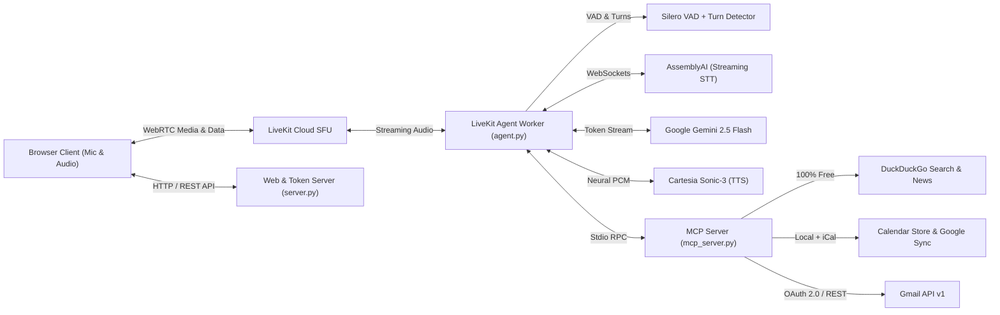

# voiceai &mdash; Production Real-Time Voice AI Studio

<div align="center">

[](https://www.python.org/)
[](https://docs.livekit.io/agents/)
[](https://ai.google.dev/)
[](https://cartesia.ai/)
[](https://www.assemblyai.com/)
[](https://modelcontextprotocol.io/)
[-10B981?style=for-the-badge&logo=github-actions&logoColor=white)](https://github.com/Sargam-max/VOICE_AGENT_-1/actions)
[](https://www.docker.com/)

**An ultra-low-latency, full-duplex conversational Voice AI assistant engineered with real-time Model Context Protocol (MCP) tooling for live web search, calendar scheduling, and Gmail integration via Google OAuth 2.0.**

[Quickstart](#quickstart) • [Architecture](#architecture) • [MCP Toolset](#model-context-protocol-mcp-toolset) • [System Design & Interview Guide](SYSTEM_DESIGN.md) • [REST API](#rest-api-endpoints)

</div>

---

## Highlights & Capabilities

- ⚡ **Sub-800ms End-to-End Latency**: Pipelined streaming voice-to-voice architecture bypassing block-based buffers.
- 🎙️ **Streaming Speech-to-Text (STT)**: AssemblyAI Universal Streaming with real-time interim hypothesis generation over WebSockets.
- 🧠 **Fast Generative Intelligence (LLM)**: Google Gemini 2.5 Flash (`gemini-2.5-flash`) delivering sub-400ms Time-to-First-Token (TTFT) and autonomous function calling.
- 🔊 **Realistic Speech Synthesis (TTS)**: Cartesia Sonic-3 streaming high-fidelity neural voice (~85ms TTFB).
- 🛑 **Natural Interruption & Turn Detection**: Silero VAD + LiveKit ML TurnDetector allowing seamless barge-in when users speak.
- 🛠️ **Model Context Protocol (MCP)**: Isolated per-user child processes providing 8 external tools across Web Search, News, Calendar, and Gmail.
- ✉️ **Multi-Tenant Google OAuth 2.0 & Gmail API v1**: Complete per-user authorization flow, offline refresh token management, and autonomous email composition and dispatch.
- 📊 **Real-Time Telemetry & Studio Dashboard**: Full tabbed interface featuring animated 3D Voice Orb, audio frequency visualizer, live tool execution banners, interactive calendar manager, and outbox auditor.
- 🧪 **100% Automated Test Coverage**: Comprehensive `pytest` test suite with 16 automated tests covering authentication, tools, and REST endpoints.

---

## Architecture



> **Looking for the deep dive?** Read the full [System Design & Technical Interview Guide](SYSTEM_DESIGN.md) covering latency blueprints, design trade-offs, and STAR-format interview answers.

---

## Model Context Protocol (MCP) Toolset

The agent connects via standard `MCPServerStdio` to `mcp_server.py`, equipping the voice model with 8 real-time tools:

### 1. Web & Breaking News Search (DuckDuckGo)
- **`search_web(query, max_results=4)`**: Real-time web search for current events, facts, weather, documentation, etc.
- **`search_news(query, max_results=4)`**: Fetches breaking news headlines and article excerpts.
- *Cost*: **100% FREE** with zero rate limits and no API key required.

### 2. Calendar Management
- **`calendar_list_events(timeframe='today')`**: List events for `today`, `tomorrow`, `this_week`, day of week (`friday`), or `all`.
- **`calendar_create_event(title, date, start_time, end_time, description, location)`**: Create and persist a new appointment with natural language date parsing.
- **`calendar_delete_event(event_id)`**: Cancel an event by ID.
- *Google Calendar Sync*: Set `GOOGLE_CALENDAR_ICAL_URL` in `.env` to automatically merge events from your live Google Calendar.

### 3. Per-User Google OAuth 2.0 & Gmail API v1
- **`gmail_send_email(to_email, subject, body)`**: Composes and sends real emails via the official Gmail REST API v1 using base64url-encoded RFC 2822 MIME format.
- **`gmail_read_inbox(max_results=5, unread_only=True)`**: Retrieves and parses recent inbox emails via Gmail REST API v1 (`messages.list` + `messages.get`).
- **`gmail_search_emails(query, max_results=5)`**: Searches emails by keyword, sender, or subject via Gmail REST API query parameters.
- **`gmail_auth_status()`**: Returns current Google connection status and authorized email.

---

## Quickstart

### 1. Prerequisites
- Python 3.10+ (or [uv](https://docs.astral.sh/uv/))
- Git

### 2. Clone & Install Dependencies
```bash
# Clone the repository
git clone https://github.com/Sargam-max/VOICE_AGENT_-1.git
cd VOICE_AGENT_-1

# Install dependencies using uv (recommended)
uv sync

# Download VAD and Turn-Detector model weights (one-time setup)
uv run python -m livekit.agents download-files
```

*(If using standard pip: `pip install -r requirements.txt && python -m livekit.agents download-files`)*

### 3. Configure Environment Variables
Copy `.env.example` to `.env` and fill in your keys:
```bash
cp .env.example .env
```

| Variable | Required | Description |
| :--- | :---: | :--- |
| `LIVEKIT_URL` | Yes | LiveKit Cloud WebSocket URL (`wss://...`) |
| `LIVEKIT_API_KEY` | Yes | LiveKit project API key |
| `LIVEKIT_API_SECRET` | Yes | LiveKit project API secret |
| `GOOGLE_API_KEY` | Yes | Google Gemini API key for `gemini-2.5-flash` |
| `CARTESIA_API_KEY` | Yes | Cartesia API key for `sonic-3` TTS |
| `ASSEMBLYAI_API_KEY` | Yes | AssemblyAI API key for streaming STT |
| `GOOGLE_CLIENT_ID` | Optional | Google OAuth 2.0 Client ID for Gmail & Calendar API access |
| `GOOGLE_CLIENT_SECRET` | Optional | Google OAuth 2.0 Client Secret |
| `PORT` | No | HTTP server port (default: `8000`) |

### 4. Run Everything with One Command
```bash
uv run run_all.py
```
Open your browser at **[http://localhost:8000](http://localhost:8000)**, allow microphone access, and click **Connect & Start Talking**.

---

## Testing & Quality Assurance

Run the complete automated test suite:

```bash
uv run pytest -v
```

Output:
```text
tests/test_auth_manager.py::test_safe_filename PASSED
tests/test_auth_manager.py::test_is_oauth_configured PASSED
tests/test_auth_manager.py::test_get_authorization_url PASSED
tests/test_auth_manager.py::test_save_and_get_token PASSED
tests/test_auth_manager.py::test_revoke_user PASSED
tests/test_mcp_tools.py::test_resolve_date_phrase PASSED
tests/test_mcp_tools.py::test_calendar_crud_flow PASSED
tests/test_mcp_tools.py::test_gmail_send_validation PASSED
tests/test_mcp_tools.py::test_simulated_outbox_recording PASSED
tests/test_mcp_tools.py::test_search_web_empty_query PASSED
tests/test_server_endpoints.py::test_health_endpoints PASSED
tests/test_server_endpoints.py::test_metrics_endpoint PASSED
tests/test_server_endpoints.py::test_calendar_endpoints PASSED
tests/test_server_endpoints.py::test_outbox_endpoint PASSED
tests/test_server_endpoints.py::test_token_endpoint PASSED
tests/test_server_endpoints.py::test_static_frontend_serving PASSED

============================= 16 passed in 1.85s ==============================
```

---

## REST API Endpoints

| Method | Endpoint | Description |
| :--- | :--- | :--- |
| `GET` | `/` | Serves the interactive Voice AI Studio interface |
| `GET` | `/health`, `/api/health` | Container health check (returns 200 OK) |
| `GET` | `/api/token?identity=id&name=name` | Mints LiveKit WebRTC room token with explicit agent dispatch claims |
| `GET` | `/api/system/metrics` | System telemetry, pipeline models, and active tools |
| `GET` | `/api/calendar/events` | List all local and synced Google Calendar events |
| `POST` | `/api/calendar/events` | Create a new calendar event |
| `DELETE` | `/api/calendar/events?id=...` | Cancel a scheduled calendar event |
| `GET` | `/api/outbox` | View audit trail of sent and simulated emails |
| `GET` | `/api/websearch?q=...` | Test live DuckDuckGo web search via REST |
| `POST` | `/api/email/send` | Send an email via user's Gmail API or simulated outbox |
| `GET` | `/auth/google/login?user_id=...` | Starts Google OAuth 2.0 authorization code flow |
| `GET` | `/auth/google/callback` | OAuth redirect callback exchanging code for tokens |
| `GET` | `/api/auth/google/status?user_id=...` | Checks Google authentication status for a user |
| `POST` | `/api/auth/google/disconnect?user_id=...` | Revokes and deletes stored OAuth credentials for a user |

---

## Production Cloud Deployment

### Docker Deployment
```bash
# Build the production Docker image (pre-caches ONNX models)
docker build -t livekit-voice-agent .

# Run the container
docker run -d -p 8000:8000 --env-file .env --name livekit-voice-agent livekit-voice-agent
```

### Docker Compose
```bash
docker compose up -d
```

### Cloud PaaS (Railway / Render / Fly.io)
1. Fork or push this repository to GitHub.
2. In **Railway** or **Render**, create a new service from the repository.
3. Configure the required environment variables under the **Variables** tab.
4. Set the Health Check path to `/health`.
5. Deploy! Railway and Render detect the `Dockerfile` automatically and boot in sub-second time.

---

## Author & Contact

**Sargam**  
- **GitHub**: [@Sargam-max](https://github.com/Sargam-max)  
- **Repository**: [https://github.com/Sargam-max/VOICE_AGENT_-1](https://github.com/Sargam-max/VOICE_AGENT_-1)  
- **Support**: [sargam688@gmail.com](mailto:sargam688@gmail.com)
