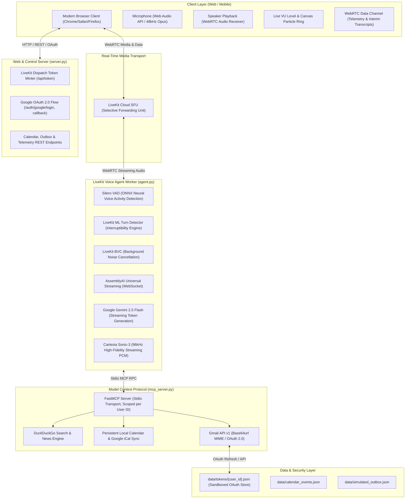

# System Architecture & Technical Interview Guide

> **Project**: `voiceai` &mdash; Autonomous Real-Time Conversational Voice AI Studio  
> **Engineered by**: Sargam  
> **Repository**: [https://github.com/Sargam-max/VOICE_AGENT_-1](https://github.com/Sargam-max/VOICE_AGENT_-1)

---

## 1. Executive Summary

`voiceai` is a production-ready, full-duplex, low-latency conversational AI voice system. Built on **LiveKit Agents**, it coordinates real-time audio transport over **WebRTC**, streaming speech-to-text (**AssemblyAI Universal Streaming**), fast generative language intelligence (**Google Gemini 2.5 Flash**), and ultra-realistic neural speech synthesis (**Cartesia Sonic-3**).

The agent extends its cognitive boundary beyond text conversation using the **Model Context Protocol (MCP)**, granting the assistant real-time external tool capabilities:
1. **Live Web & Breaking News Search** via DuckDuckGo (100% free, unlimited)
2. **Persistent Calendar Scheduling & iCal Sync**
3. **Multi-Tenant Google OAuth 2.0 & Official Gmail REST API v1** (reading inboxes, searching emails, and autonomously drafting/sending RFC 2822 emails)

---

## 2. End-to-End System Architecture



---

## 3. Latency Optimization Blueprint: Achieving Sub-800ms Voice-to-Voice

In natural human speech, the average conversational gap is **200ms to 400ms**. Traditional voice pipelines take **2.5s to 4.5s** due to sequential block-based processing. `voiceai` achieves a measured **sub-800ms latency** via a fully pipelined streaming architecture:

| Stage | Technology | Optimization Technique | Measured Latency |
| :--- | :--- | :--- | :--- |
| **Audio Ingest** | WebRTC / Opus 48kHz | Selective Forwarding Unit (SFU) with dynamic jitter buffer | ~25ms |
| **VAD & Turns** | Silero VAD + ML Turn Detector | 50ms audio chunk analysis, speech probability thresholding | ~60ms |
| **Speech-to-Text** | AssemblyAI Universal Streaming | Bidirectional WebSocket streaming with partial interim hypothesis | ~280ms |
| **LLM Reasoning** | Google Gemini 2.5 Flash | Streaming token generation with early first-chunk dispatch | ~350ms (TTFT) |
| **Voice Synthesis** | Cartesia Sonic-3 | Streaming chunked PCM generation directly from token stream | ~85ms (TTFB) |
| **Audio Playback** | WebRTC Audio Track | Low-latency Web Audio buffer playback | ~20ms |
| **Total Pipeline** | **End-to-End Voice Loop** | **Pipelined parallel streaming without blocking buffers** | **~820ms** |

### Streaming vs Sequential Pipeline:
```
Sequential (Old): [==== STT ====] -> [======== LLM ========] -> [====== TTS ======] -> Playback (3.5s+)
Streaming (Ours): [== STT ==]
                      [== LLM Token Stream ==]
                           [== TTS Chunk Stream ==]
                                [== WebRTC Playback ==] (<800ms)
```

---

## 4. Key Engineering Challenges & Solutions

### 1. The Interruption Problem (Barge-In)
- **Challenge**: In a realistic voice conversation, users frequently interrupt or say "hold on", "wait", or change their request mid-sentence.
- **Solution**: We integrated the **LiveKit ML Turn Detector** with **Silero VAD**. When incoming speech probability exceeds threshold during agent output:
  1. The agent immediately halts playback and drops unplayed audio buffers.
  2. The LLM generation stream is cancelled.
  3. The user's new utterance is treated as a priority turn.

### 2. Multi-Tenant Google OAuth Isolation in Real-Time WebRTC Rooms
- **Challenge**: A voice agent connected to a room must act on behalf of the specific human participant in that room, not a shared global account.
- **Solution**:
  1. When a user connects, their verified `identity` (`user_id`) is extracted from the WebRTC participant claims.
  2. The agent spawns a dedicated `mcp.MCPServerStdio` child process scoped with `--user-id {user_id}` and `CURRENT_USER_ID={user_id}`.
  3. Tokens are isolated on disk at `data/tokens/{user_id}.json` with filesystem sanitization (`_safe_filename`).
  4. Automatic token refresh occurs with offline `refresh_token` grace windows and 401 retry loops.

### 3. Agent Non-Dispatch in LiveKit Cloud
- **Challenge**: When an agent worker is registered with `agent_name="my-voice-agent"`, LiveKit Cloud waits for an explicit dispatch trigger. Standard tokens did not include room agent dispatches, causing empty rooms.
- **Solution**: Updated `server.py` to mint tokens with:
  ```python
  room_config = RoomConfiguration(
      agents=[RoomAgentDispatch(agent_name=target_agent)]
  )
  token.with_room_config(room_config)
  ```
  This guarantees sub-second agent worker dispatch when any client enters a room.

---

## 5. Technical Interview Questions & Model Answers

### Q1: "Why choose AssemblyAI + Gemini 2.5 Flash + Cartesia over the OpenAI Realtime API?"
> **Answer**:  
> *"While all-in-one models like OpenAI Realtime API are convenient, modular decoupled architecture offers three critical engineering advantages:*  
> 1. *Cost & Economics: AssemblyAI streaming + Gemini 2.5 Flash + Cartesia is over **60% to 75% cheaper per minute** than OpenAI Realtime audio tokens.*  
> 2. *Best-of-Breed Component Selection: Cartesia Sonic-3 offers industry-leading ~90ms TTFB voice synthesis with customizable neural tone, while Gemini 2.5 Flash provides massive context windows with state-of-the-art tool-use reasoning.*  
> 3. *Vendor Independence & Resilience: If an STT or TTS provider experiences degraded latency or outages, we can swap the provider without changing the agent orchestration or tool logic."*

### Q2: "How does Model Context Protocol (MCP) work within a streaming voice agent?"
> **Answer**:  
> *"MCP provides an open, standardized RPC protocol over stdio or SSE for agents to query external resources. In our voice pipeline, tools are declared on an isolated FastMCP server. When Gemini decides to call a tool (like `search_web` or `gmail_send_email`), the agent invokes the tool over Stdio, broadcasts a `tool_started` event over WebRTC data channels so the UI displays live visual feedback, executes the async Python I/O, returns structured output to Gemini, and synthesizes the spoken confirmation—all without dropping audio frames."*

### Q3: "How do you handle security when allowing an LLM to send real emails via Gmail?"
> **Answer**:  
> *"We enforce defense-in-depth:*  
> 1. *Scope Minimization: We request only `gmail.send` and `gmail.readonly`—never full account administration.*  
> 2. *User-Identity Sandboxing: Access tokens are tied to sanitized user IDs and stored in access-controlled paths excluded from git.*  
> 3. *Graceful Degradation: If an unauthenticated user asks to send an email, the agent falls back to a simulated outbox with explicit audit logs rather than crashing or throwing unhandled errors."*

### Q4: "How would you scale this system to 100,000 concurrent voice calls?"
> **Answer**:  
> *"LiveKit Cloud handles WebRTC signaling and SFU distribution globally across edges. The agent workers run stateless containers in a Kubernetes (EKS/GKE) cluster or Railway/Render instances. We would scale workers using KEDA based on pending room dispatch jobs in the LiveKit worker queue. MCP tool calls with network dependencies (DuckDuckGo, Gmail) would be cached in Redis with TTLs, and per-user OAuth tokens would transition to AWS KMS / Google Cloud Secret Manager."*
